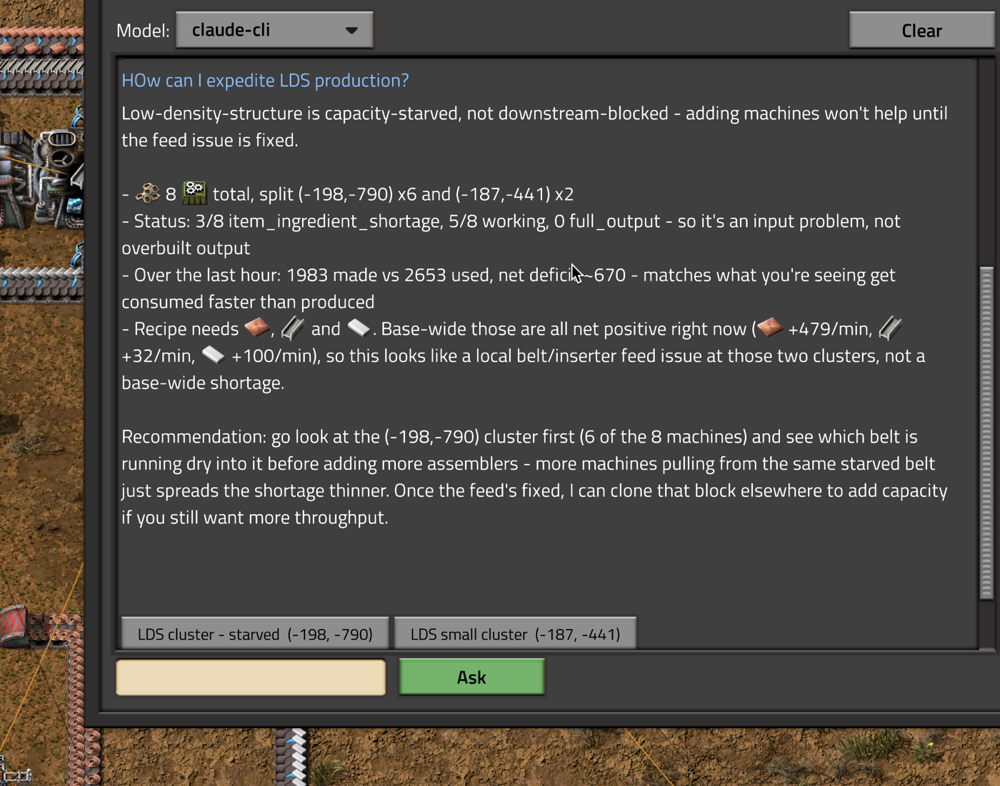

# Ask the Factory

Your factory already knows what's wrong with it. This is how you ask.

Ask an LLM about your Factorio base from inside the game. What you're producing, where it
is, what's stalled, what to fix next.

It reads your actual save — production rates, power, machine status, research, trains — and
answers with real numbers, with clickable buttons that jump your map to the place it's
talking about.



## Why it runs a local server

Factorio's Lua sandbox is one-way: a mod can write files out, but nothing can send data
back in. The only channel into a running game is **RCON**, and Factorio only opens that
port in server mode — a normal client accepts the flags and ignores them.

So the launcher starts a local server and connects your client to it. Same save, same mods,
feels like singleplayer. Your original saves are never touched; it works on a copy.

One consequence: replies arrive as console commands, so **achievements are off** on the
session save.

## Getting started

Grab the archive for your platform from
[Releases](https://github.com/Zappatta/factorio-ask-the-factory/releases), unpack it, and
run `ask-the-factory` from the unpacked folder. It needs `config.toml` and `mod/` beside it.
The macOS builds are unsigned: run `xattr -dr com.apple.quarantine <folder>` once.

Or build from source:

```bash
cd launcher-gui && cargo build --release
./launcher-gui/target/release/ask-the-factory
```

Pick a save, hit **Launch**. It sets up the server, starts everything, and opens Factorio
already connected. In game press **Ctrl+Shift+L**.

**Stop** shuts it down cleanly and writes a final save. **Export session…** copies your
progress back to your normal saves folder.

The launcher is one self-contained binary: no Python, no runtime to install. The system
prompt is baked in, but a `prompt.txt` beside the executable or at the project root
overrides it without a rebuild.

To ask a one-off question from a terminal while a session is running:

```
./launcher-gui/target/release/ask-the-factory --ask "why is my coal backed up?"
./launcher-gui/target/release/ask-the-factory --ask "..." --show-snapshot
```

## Models

Switchable from a dropdown while you play. Defaults to `claude-cli`, which uses your
existing Claude Code login — no API key needed.

| | |
|---|---|
| `claude-cli` | your Claude Code login |
| `anthropic-api` | `ANTHROPIC_API_KEY` |
| `ollama` | local models |
| `openai-compatible` | LM Studio, llama.cpp, vLLM, OpenRouter |

Local models work but are noticeably weaker at reasoning over a factory. They get a
smaller snapshot automatically so they fit in a modest context window.

## Placing things — experimental

The model can also propose changes to your factory. **This part is not reliable yet.**
Treat anything it suggests as a draft and look at it before pressing anything.

Nothing is applied without a click, and everything is reversible:

- **Place** — creates the entities immediately and free
- **Place ghosts** — ghosts your construction robots build from your own materials
- **Undo** — removes exactly what was created, nothing else

Asking it to *copy something you already built* works far better than asking it to design
something new — it uses Factorio's own blueprint machinery, so belts, inserters and recipes
come across exactly. Asking it to lay out chests and inserters from scratch usually
produces something subtly wrong, because it can't see belts or inserters in the first place.

Use **Place ghosts** while you're evaluating it. A bad suggestion then just sits there
unbuilt instead of quietly rearranging your base.

## Similar projects

If this isn't quite what you want, these take a different approach to the same idea:

- [factorio-sensei](https://github.com/alloc33/factorio-sensei) — a coach you ask with
  `/sensei` in game chat or from a terminal. Attaches to a game you host yourself, looks up
  what each question needs, and advises only. Anthropic API.
- [AI Agent Bridge](https://github.com/bits-orio/ai-agent-bridge) — built for multiplayer
  servers: `/ask` in chat, answers per team, cost caps and rate limits, and an open protocol
  other mods can extend. Read-only. OpenRouter or the Anthropic API.

Ask the Factory differs in running the server for you, answering in its own window with
map buttons, working with a Claude Code login or a local model, and being able to place and
copy things.

## More

- [`AGENTS.md`](AGENTS.md) — if you are a coding agent, read this first.

- [`docs/ARCHITECTURE.md`](docs/ARCHITECTURE.md) — how it works, what the model sees, the
  markers it can emit, dev tools, and a pile of Factorio 2.0 API notes that cost real time
  to work out.
- [`docs/PROGRESS.md`](docs/PROGRESS.md) — where it stands and what is next.
- [`docs/BOOTSTRAP.md`](docs/BOOTSTRAP.md) — how it was built, what was tried and dropped,
  and what the failures taught.
